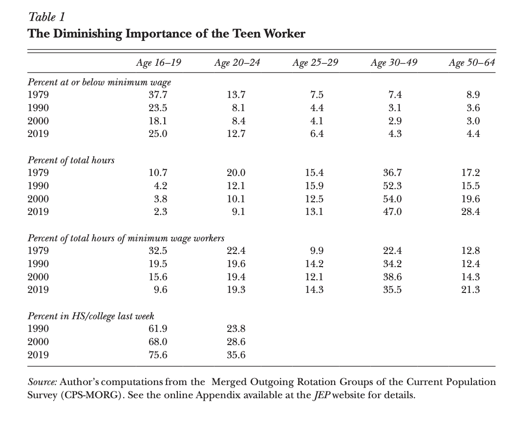
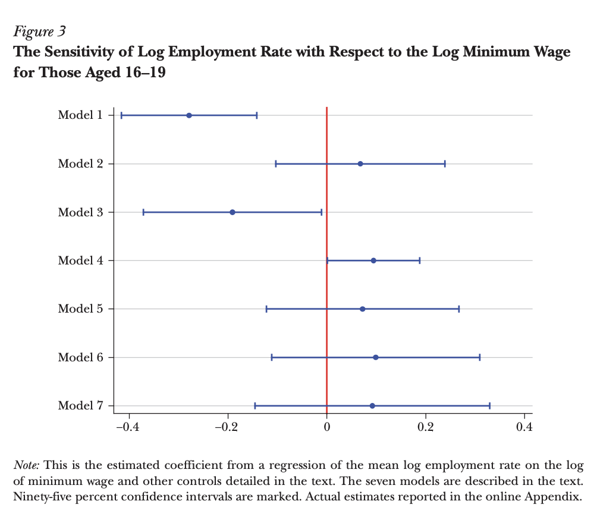

---
output:
  xaringan::moon_reader:
    css: xaringan-themer.css
    nature:
      ratio: 16:9
      seal: false
---
class: middle, center, inverse

```{r xaringan-tile-view, echo = FALSE}

xaringanExtra::use_tile_view()
```

```{r xaringan-animate, echo=FALSE}
xaringanExtra::use_animate_all("slide_left")

```

```{r xaringan-editable, echo = FALSE}
xaringanExtra::use_editable()
```


<style type="text/css">
.remark-slide-content {
    font-size: 15px;
    padding: 4em 8em 4em 8em;
}
.my-one-page-font {
  font-size: 14px;
}
</style>

```{r xaringan-themer, include = FALSE}
library(xaringanthemer)
style_mono_accent(base_color = "#d00000",
                  header_font_google = google_font("Saira Semi Condensed"), #Cinzel, Sacramento
                  text_font_google   = google_font("Montserrat", "300", "300i"))

```

# The Elusive Employment Effect of the Minimum Wage

.middle[
Bhabishya Neupane | ECON 481 | April 2, 2021
]

---
class: top, left
# Author:

 

__Alan Manning__  
  
Professor at London School of Economics
  
Areas of Expertise:

- Labor Markets
- Unemployment
- Minimum wages
- Monopsony
- Immigration
- Gender Wage Gap  


---
class: left, middle


# Research Question:


1. Why is it difficult to find negative employment effects of minimum wage? 
  
2. How high can the minimum wage be raised to without observing significant effects on employment?

---
class: left, middle


## Signficance of the question:  

- The debate of whether the minimum wage has employment effects will continue for many years to come, and still the empployment effects might be elusive at that point. But, continuing to ask this question might allow us to detect a range of increases in minimum wage that would actually yield in negative employment effects. This quest of finding the cutoff point beyond which negative employment effects could be observed would allow the policy makers and any labor market to create an environment for workers to enjoy the minimum standard of living, while also protecting their health and well being.

---
class: top

# Tables and Figures:

.pull-left[
```{r echo=FALSE, out.width='80%'}
# local

```
]

.pull-right[
```{r echo=FALSE, out.width='80%'}
# local

```
]
  
---
class: middle, left

#Conclusions:

- Looking at the international scene, there are countries that saw some disemployment effects when increasing the minimum wage, and there are some countries that didn't observe any employment effects. However, one thing was common in all of these countries and that was they observed impact on the wages. 
  
- The paper also concludes, that there is an ambiguous employment effect of minimum wage, but reiterates that the wage effect is robust. 
  
- The paper also confirms that there is a level of minimum wage where the employment would decline, but that hasn't been observed yet.  
  
- The paper also mentions about how the low labor demand elasticity might make it difficult to find negative employment effects of the minimum wage.

---
class: middle, left

#Further Study:

- Like the paper suggests about using better data, and as difficult as it might be, doing an analysis on longitudinal individual data rather than aggregate data in some low wage industries where the impact of increase in minimum wage could be observable would be something I'd be interested in exploring. 
  
- Also, not sure if it is plausible, but increasing minimum wage in a certain low wage industries until we observe negative employment effects to see what the cutoff would be in that industry would be interesting to see. Doing across all industries might be expensive, so choosing an industry or subset of that industry to predict that cutoff would also be an interesting finding.  

---
class: middle, left

# Critique:

- Critique: Elaborating on the concept of how wages and labor costs are different in any given industry would have made it much easier to understand the low-pass through topic. I think coming across terms as minimum wages, wages, employment, labor market, and so on repeatedly in a paper might force a reader to mix up the concepts, at least I did. 


---

class: middle, center, inverse

# The floor is open for discussion
